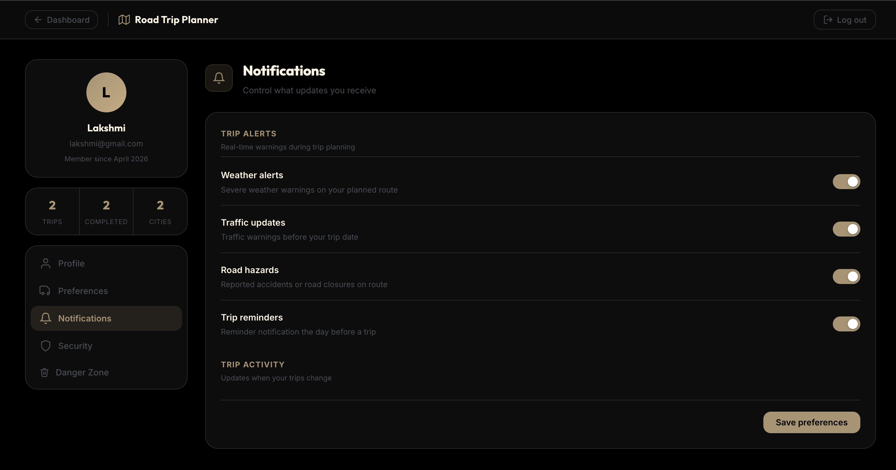
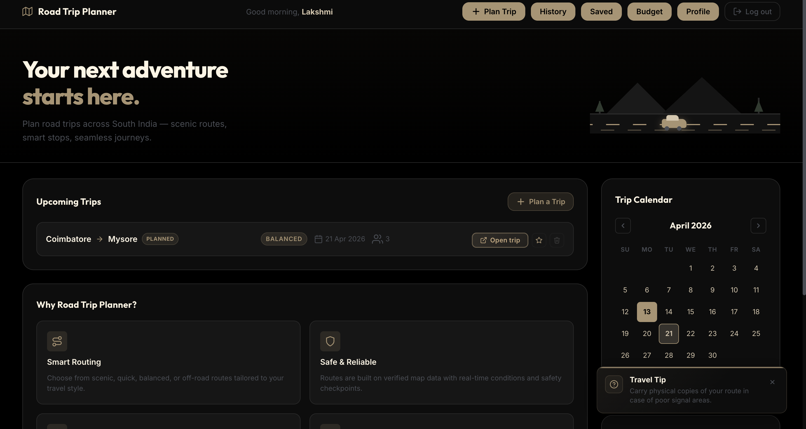
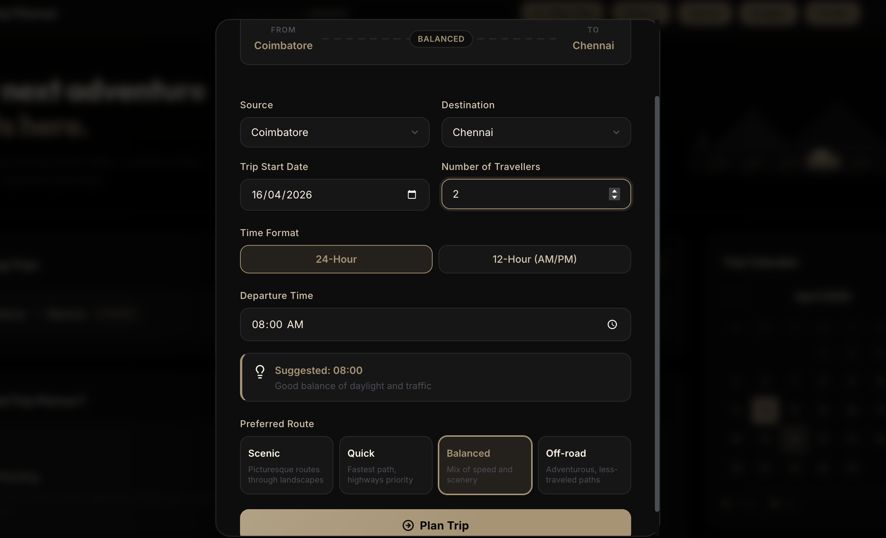
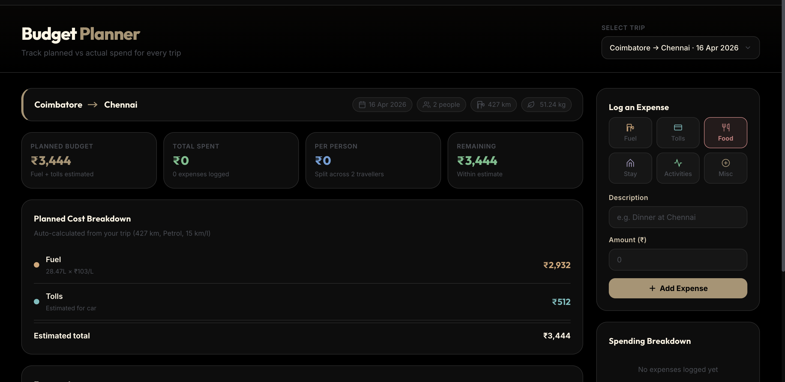
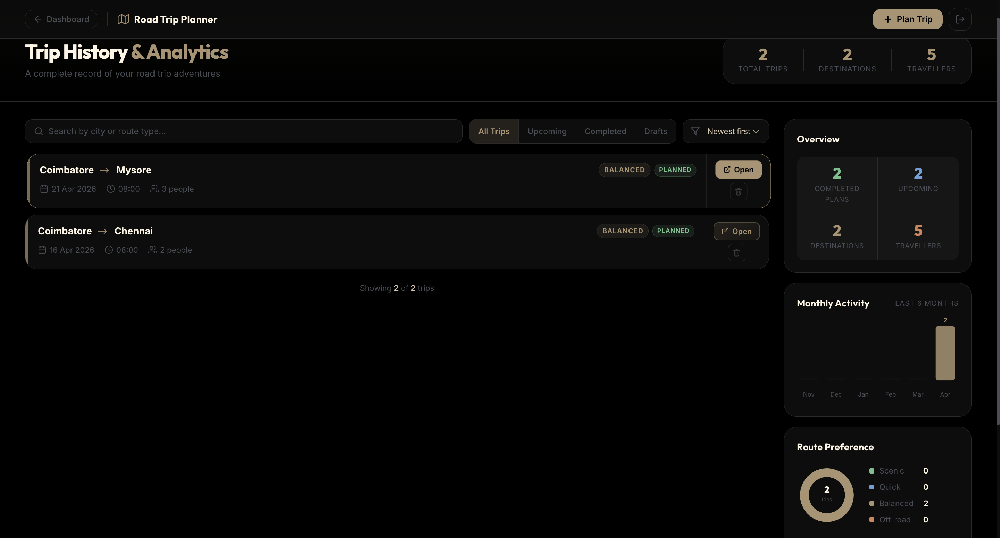
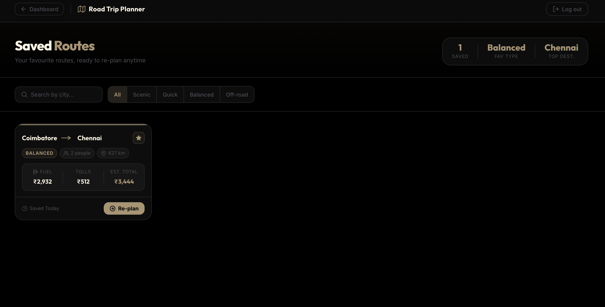

# Road Trip Planner

A full-stack intelligent road trip planning application that helps users plan personalized road trips with real-time data, weather forecasts, POI discovery, and cost estimation.

## Overview

Road Trip Planner is a web application that analyzes routes, provides real-time traffic and weather data, discovers points of interest, and offers personalized recommendations based on route type preferences (scenic, quick, balanced, off-road).

**Live Demo:** http://localhost:5173 (after running locally)

---

## Previews

| Home Page | Dashboard |
|---|---|
|  |  |

| Plan Trip | Trip Result |
|---|---|
|  |  |

| Budget Planner | Trip History |
|---|---|
|  |  |

| Saved Routes | Profile Page |
|---|---|
|  |  |

---

## Features

### Core Features
- **User Authentication** - Secure registration, login, and JWT-based sessions
- **Smart Trip Planning** - 4 route types with different optimization strategies
- **Real-time POI Discovery** - Restaurants, fuel stations, hospitals, ATMs, pharmacies, police, viewpoints, EV charging, rest areas
- **Weather Forecasting** - Real-time weather data for each city on the route
- **Cost Estimation** - Fuel costs, toll calculations, carbon footprint analysis
- **Traffic Analysis** - Real-time traffic levels and risk assessment
- **Interactive Map** - Leaflet-based map with route visualization, POI markers, traffic layers
- **Time Format Options** - 24-hour and 12-hour (AM/PM) format support
- **Smart Departure Suggestions** - Recommended departure times based on route type
- **Trip History** - Save and view past trips
- **Saved Routes** - Bookmark favorite routes
- **Budget Planner** - Track and plan trip expenses
- **Admin Panel** - User management and role-based access control
- **Elevation Profile** - Visual elevation chart along the route
- **PDF Export** - Download trip details as PDF

### Route Types
| Type | Characteristics | Use Case |
|------|-----------------|----------|
| **Quick** | Direct route, minimal stops, 15% faster | Business, urgent travel |
| **Scenic** | Multiple intermediate cities, 20% slower, more stops | Leisure, sightseeing |
| **Balanced** | Moderate intermediates, normal speed | General travel |
| **Off-road** | Adventure routes, 35% slower, rough terrain | Exploration, adventure |

---

## Tech Stack

### Frontend
- **React 18** - UI framework
- **Vite** - Build tool & dev server
- **Leaflet** - Interactive maps
- **React Router** - Client-side routing
- **Axios** - HTTP client
- **CSS Modules** - Component-scoped styling

### Backend
- **FastAPI** - Modern Python web framework
- **SQLAlchemy** - ORM for database operations
- **SQLite** - User authentication database
- **Cassandra** - Route data storage (optional)
- **Apache Spark MLlib** - ML-based travel time predictions
- **Python-jose** - JWT token generation
- **Passlib** - Password hashing with Argon2

### External APIs
- **OSRM** (Open Source Routing Machine) - Route polylines
- **Overpass API** - POI data from OpenStreetMap
- **Open-Elevation API** - Elevation profiles
- **Weather APIs** - Real-time forecasts

---

## Project Structure

```
Road-trip-planner/
├── backend/
│   ├── routes/
│   │   ├── auth.py              # Authentication endpoints
│   │   ├── trip.py              # Trip planning endpoint
│   │   └── ml.py                # ML model endpoints
│   ├── services/
│   │   ├── cassandra_service.py # Route data queries
│   │   ├── ml_service.py        # Travel time predictions
│   │   ├── routing_service.py   # Polyline generation
│   │   └── weather_service.py   # Weather forecasts
│   ├── auth.py                  # JWT & password utilities
│   ├── database.py              # SQLite setup
│   ├── models.py                # User model
│   ├── schemas.py               # Pydantic schemas
│   ├── main.py                  # FastAPI app entry
│   ├── requirements.txt          # Python dependencies
│   └── .env                     # Environment variables
│
├── frontend/
│   ├── src/
│   │   ├── pages/
│   │   │   ├── Home.jsx         # Landing page
│   │   │   ├── Login.jsx        # Login page
│   │   │   ├── Register.jsx     # Registration page
│   │   │   ├── Dashboard.jsx    # Main dashboard
│   │   │   ├── TripResult.jsx   # Trip results with map
│   │   │   ├── TripHistory.jsx  # Past trips
│   │   │   ├── Profile.jsx      # User profile
│   │   │   ├── SavedRoutes.jsx  # Favorite routes
│   │   │   ├── Budget.jsx       # Budget planner
│   │   │   ├── AdminPanel.jsx   # Admin controls
│   │   │   ├── tripUtils.js     # Utility functions
│   │   │   └── generateItinerary.js # Itinerary generation
│   │   ├── components/
│   │   │   ├── PlanTripModal.jsx    # Trip planning form
│   │   │   ├── ProtectedRoute.jsx   # Auth guard
│   │   │   ├── NotificationToast.jsx # Notifications
│   │   │   └── ... (other components)
│   │   ├── api/
│   │   │   ├── auth.js          # Auth API calls
│   │   │   └── tripApi.js       # Trip API calls
│   │   ├── App.jsx              # Main app component
│   │   └── main.jsx             # React entry point
│   ├── package.json             # Node dependencies
│   └── vite.config.js           # Vite configuration
│
├── pipeline/                    # Data engineering & Spark scripts
│   ├── extract_poi.py           # POI extraction script
│   ├── kafka_traffic_producer.py # Kafka producer
│   ├── spark_ml.py              # ML model training
│   ├── spark_traffic_consumer.py # Spark consumer
│   └── test_weather.py          # Weather test script
│
├── datasets/                    # Raw and processed data files
│   ├── poi_all_cities.csv       # Extracted POI data
│   └── weather_data.csv         # Weather data
│
├── preview_images/              # Site preview images
├── docker-compose.yml           # Docker services
├── .gitignore                   # Git ignore rules
└── README.md                    # This file
```

---

## Data Flow

### User Registration & Login
```
User Registration:
  1. User fills form (username, email, password)
  2. Frontend validates input
  3. POST /api/auth/register
  4. Backend hashes password with Argon2
  5. Creates user in SQLite database
  6. Returns JWT token
  7. Token stored in localStorage
  8. User redirected to Dashboard

User Login:
  1. User enters email & password
  2. POST /api/auth/login
  3. Backend verifies credentials against SQLite
  4. Returns JWT token
  5. Token stored in localStorage
  6. User can access protected routes
```

### Trip Planning
```
Trip Planning Flow:
  1. User clicks "Plan Your Trip"
  2. Modal opens with form
  3. User selects:
     - Source city
     - Destination city
     - Travel date
     - Number of passengers
     - Route type (scenic/quick/balanced/offroad)
     - Departure time (24h or 12h format)
  4. Frontend validates form
  5. POST /api/plan_trip with parameters
  6. Backend processes:
     a. Validates cities & date
     b. Calculates ordered route based on route type
     c. Fetches segment data (Cassandra or mock)
     d. Adjusts travel times based on route type
     e. Fetches polyline from OSRM
     f. Fetches weather for each city
     g. Calculates costs (fuel, tolls, carbon)
  7. Returns complete trip JSON
  8. Frontend displays TripResult page with:
     - Interactive map with route
     - Route type details & cities
     - Segment breakdown
     - Weather forecast
     - Cost breakdown
     - Risk assessment
     - POI markers
```

### POI Discovery
```
POI Fetching:
  1. TripResult page loads
  2. For each city on route:
     a. Fetch POI data from Overpass API
     b. Query for: restaurants, fuel, hospitals, hotels, ATMs, pharmacies, police, viewpoints, EV charging, rest areas
     c. Extract real data: name, phone, website, hours, email, wheelchair access, cuisine, operator
  3. Display markers on map with real details
  4. User can click markers to see:
     - Name, brand, phone, website
     - Opening hours, email
     - Wheelchair accessibility
     - Link to Google Maps
```

---

## Data Storage

### SQLite Database (User Data)
**Location:** `backend/roadtrip_auth.db`

**Table: users**
```sql
CREATE TABLE users (
  id INTEGER PRIMARY KEY,
  username VARCHAR(50) UNIQUE NOT NULL,
  email VARCHAR(100) UNIQUE NOT NULL,
  hashed_password VARCHAR(255) NOT NULL,
  role VARCHAR(20) DEFAULT 'user',  -- 'user' or 'admin'
  created_at DATETIME DEFAULT CURRENT_TIMESTAMP
)
```

### Cassandra Database (Route Data - Optional)
**Table: route_results**
```
segment_start, segment_end, distance_km, avg_speed,
travel_time_min, fuel_stops, restaurants, hospitals,
traffic_level, weather_risk, timestamp
```

### Browser LocalStorage (Frontend Data)
```javascript
localStorage.getItem('token')           // JWT token
localStorage.getItem('user')            // User object (JSON)
localStorage.getItem('trips')           // Trip history
localStorage.getItem('savedRoutes')     // Favorite routes
```

### External Data Sources
| Source | Data | API |
|--------|------|-----|
| OpenStreetMap | POI (restaurants, fuel, hospitals, etc.) | Overpass API |
| OSRM | Route polylines | http://router.project-osrm.org |
| Open-Elevation | Elevation profiles | https://api.open-elevation.com |
| Weather Service | Temperature, rain, wind | Configured in backend |

---

## API Endpoints

### Authentication
```
POST   /api/auth/register          # Create account
POST   /api/auth/login             # Login
GET    /api/auth/admin/users       # List users (admin only)
POST   /api/auth/admin/promote     # Change user role (admin only)
DELETE /api/auth/admin/users/{id}  # Delete user (admin only)
```

### Trip Planning
```
GET    /api/plan_trip              # Plan a trip
  Query params:
    - source (string): Source city
    - destination (string): Destination city
    - date (string): Travel date (YYYY-MM-DD)
    - passengers (int): Number of passengers (1-50)
    - route (string): Route type (scenic/quick/balanced/offroad)

GET    /api/debug_route            # Debug route types
```

### Response Format
```json
{
  "route": {
    "source": "Chennai",
    "destination": "Bangalore",
    "ordered_cities": ["Chennai", "Mysore", "Bangalore"],
    "polyline": [[13.08, 80.27], [12.29, 76.63], ...],
    "total_distance_km": 250,
    "type": "scenic"
  },
  "segments": [
    {
      "start": "Chennai",
      "end": "Mysore",
      "distance_km": 140,
      "travel_time_min": 180,
      "avg_speed_kmh": 62,
      "traffic_level": "MODERATE",
      "weather_risk": "LOW",
      "stops": { "fuel": 2, "restaurants": 5, "hospitals": 1 }
    }
  ],
  "summary": {
    "travel_time_min": 360,
    "stop_time_min": 60,
    "total_trip_time_min": 420,
    "passengers": 2,
    "date": "2026-04-15"
  },
  "weather": [
    {
      "city": "Chennai",
      "temperature": 32,
      "rain_probability": 30,
      "wind_speed": 15
    }
  ]
}
```

---

## Installation & Setup

### Prerequisites
- Node.js 16+ & npm
- Python 3.10+
- Git

### Backend Setup
```bash
cd backend

# Create virtual environment
python -m venv venv
source venv/Scripts/activate  # Windows
# or
source venv/bin/activate      # macOS/Linux

# Install dependencies
pip install -r requirements.txt

# Create .env file
cp .env.example .env  # Configure as needed

# Run migrations (if needed)
python -c "from database import engine; from models import Base; Base.metadata.create_all(bind=engine)"

# Start backend
uvicorn main:app --reload
```

### Frontend Setup
```bash
cd frontend

# Install dependencies
npm install

# Start dev server
npm run dev
```

### Access Application
- Frontend: http://localhost:5173
- Backend API: http://localhost:8000
- API Docs: http://localhost:8000/docs

---

## Usage

### 1. Register & Login
- Click "Sign Up" on home page
- Fill registration form
- Login with credentials
- Dashboard loads

### 2. Plan a Trip
- Click "Plan Your Trip"
- Select source & destination cities
- Choose travel date
- Select route type (scenic/quick/balanced/offroad)
- Choose time format (24h or 12h)
- Review suggested departure time
- Click "Plan Trip"

### 3. View Trip Results
- Interactive map shows route
- Route type details displayed
- Cities on route listed
- Segments breakdown shown
- Weather forecast visible
- POI markers on map
- Cost breakdown calculated
- Risk assessment shown

### 4. Interact with Map
- Toggle layers (traffic, POI, tolls)
- Filter POI types
- Click markers for details
- Zoom in/out
- Pan around

### 5. Save & Share
- Save trip to favorites
- Download as PDF
- View trip history
- Compare multiple trips

---

## Configuration

### Environment Variables (.env)
```
# Backend
DATABASE_URL=sqlite:///./roadtrip_auth.db
SECRET_KEY=your-secret-key-here
ALGORITHM=HS256
ACCESS_TOKEN_EXPIRE_MINUTES=60

# Cassandra (optional)
CASSANDRA_HOSTS=localhost
CASSANDRA_PORT=9042
CASSANDRA_KEYSPACE=roadtrip

# Weather API
WEATHER_API_KEY=your-api-key
WEATHER_API_URL=https://api.weather.com
```

---

## Performance Optimizations

- **Parallel API Calls** - Weather & polyline fetched simultaneously
- **Caching** - Trip data cached in localStorage
- **Lazy Loading** - POI data fetched on demand
- **Debouncing** - Map interactions debounced
- **Code Splitting** - Routes lazy-loaded in React
- **Image Optimization** - SVG icons used throughout

---

## Security Features

- **JWT Authentication** - Secure token-based auth
- **Password Hashing** - Argon2 hashing algorithm
- **Role-Based Access** - Admin/user roles
- **Protected Routes** - Frontend route guards
- **CORS Configuration** - Restricted origins
- **Environment Secrets** - Sensitive data in .env

---

## Supported Cities

- Bangalore
- Chennai
- Coimbatore
- Hyderabad
- Kochi
- Mysore
- Puducherry

---

## Future Enhancements

- Real-time traffic updates via WebSocket
- Multi-stop trip planning
- Vehicle-specific route optimization
- Social trip sharing
- Community reviews & ratings
- Accommodation booking integration
- Real-time GPS tracking
- Offline map support
- Mobile app (React Native)

---

## Troubleshooting

### Backend won't start
```bash
# Check Python version
python --version  # Should be 3.10+

# Reinstall dependencies
pip install -r requirements.txt --force-reinstall

# Check port 8000 is available
lsof -i :8000  # macOS/Linux
netstat -ano | findstr :8000  # Windows
```

### Frontend won't load
```bash
# Clear node_modules & reinstall
rm -rf node_modules package-lock.json
npm install

# Clear Vite cache
rm -rf .vite
npm run dev
```

### API calls failing
```bash
# Check backend is running
curl http://localhost:8000/docs

# Check CORS configuration in main.py
# Verify frontend URL is in allow_origins
```

### Database issues
```bash
# Reset SQLite database
rm backend/roadtrip_auth.db
python -c "from database import engine; from models import Base; Base.metadata.create_all(bind=engine)"
```

---

## Contributing

1. Fork the repository
2. Create feature branch (`git checkout -b feature/amazing-feature`)
3. Commit changes (`git commit -m 'Add amazing feature'`)
4. Push to branch (`git push origin feature/amazing-feature`)
5. Open Pull Request

---

## License

This project is licensed under the MIT License - see LICENSE file for details.

---

## Support

For issues, questions, or suggestions:
- Open an issue on GitHub
- Contact: [your-email@example.com]
- Documentation: [link to docs]

---

## Acknowledgments

- OpenStreetMap & Overpass API for POI data
- OSRM for routing
- Apache Spark for ML predictions
- FastAPI for backend framework
- React community for frontend tools
